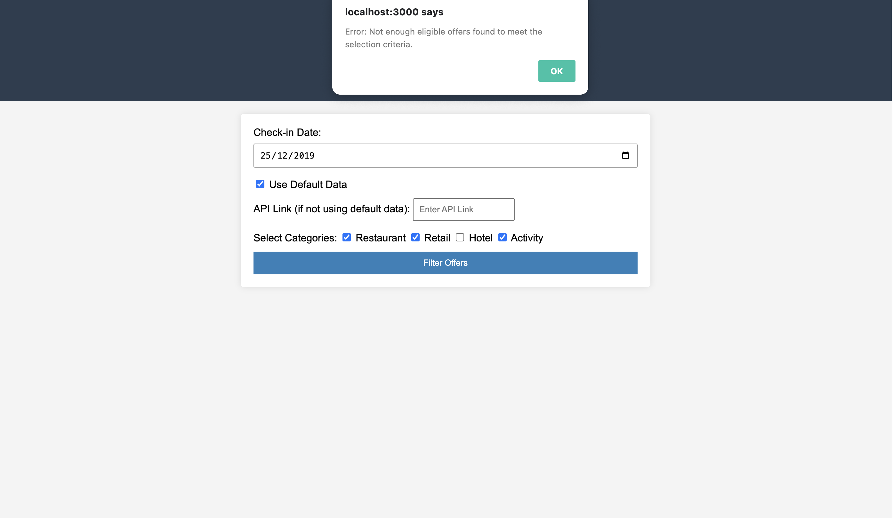
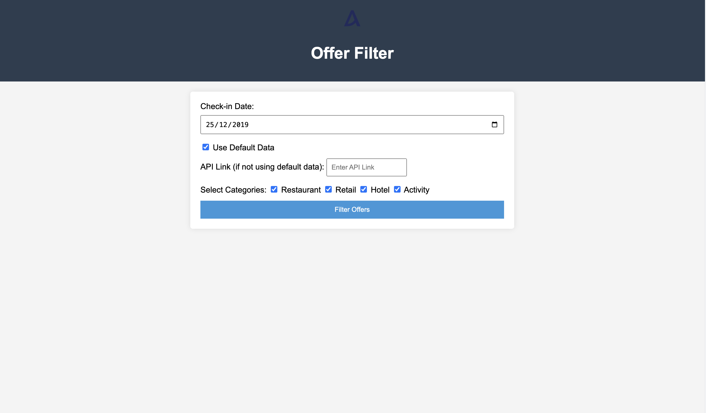
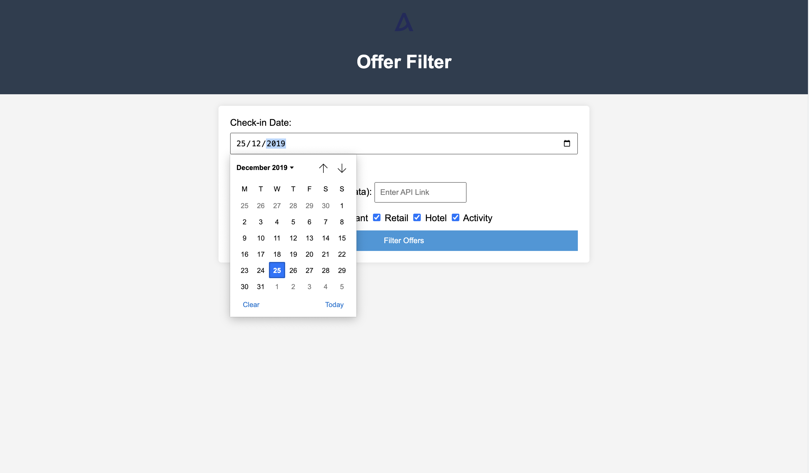
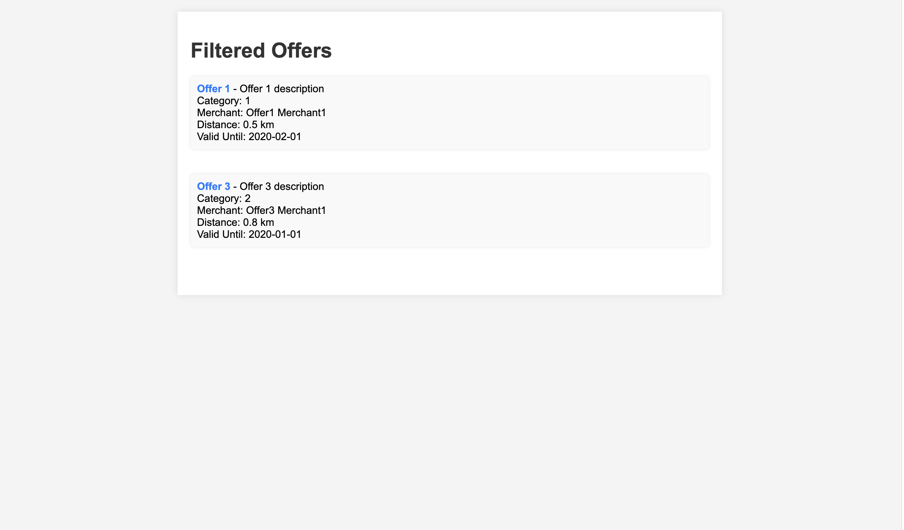

# Offer Filter App

The Offer Filter App is a web application that allows users to filter and display offers based on certain criteria.

## Table of Contents

- [Installation](#installation)
- [Usage](#usage)
- [Folder Structure](#folder-structure)
- [API Endpoints](#api-endpoints)
- [Screenshots](#screenshots)
- [Contributing](#contributing)
- [License](#license)

## Installation

1. **Clone the repository:**

   ```bash
   git clone https://github.com/hoangteo0103/travel_excercises.git

2. **Install dependency:**
   ```bash
   npm install

## Usage
### Running the Application
-  Start the server:

   ```bash
   npm start
- Open your web browser and go to http://localhost:3000.
- Use the web interface to filter offers based on check-in date, categories, and API link.

## Handling Edge Cases
### No API Link Provided:

- If the user doesn't provide an API link, the application will use default data for filtering.
### Not Enough Eligible Offers:

-  If there are not enough eligible offers found to meet the selection criteria, an appropriate message will be displayed.
### No Eligible Offers Found:

-  If no eligible offers are found based on the specified criteria, an appropriate message will be displayed.

### Outputting Data to output.json
-  The filtered offers will be displayed on the result page.
-  Additionally, the application will output the selected offers to an output.json file in the project directory.
## Folder Structure
- public: Static assets (CSS, images, etc.)
- views: EJS templates for the frontend
- server.js: Express.js server setup
- offerFilter.js: Backend logic for filtering offers
- README.md: Project documentation

## API Endpoints
-  GET /: Home page
-  POST /filter: Filter offers based on user input

## Screenshots
### User Interface

- Choosing date

### Filtered offers
